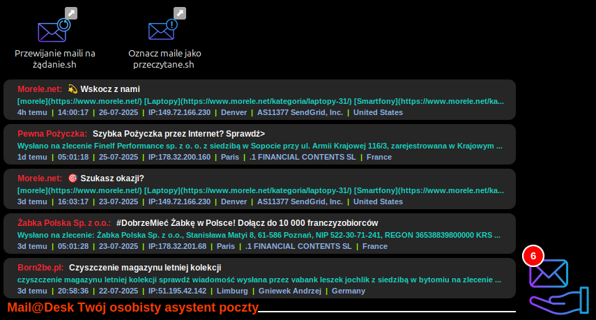

# Conky AutoMail Suite - Zaawansowany Widżet Pocztowy z Obsługą Wielu Kont




**Conky AutoMail Suite** to nie tylko widżet, ale kompletny, modułowy system do monitorowania poczty e-mail w środowisku Conky na Linuksie. Dzięki zaawansowanej architekturze z demonem w Pythonie, graficznym narzędziom konfiguracyjnym i potężnym możliwościom personalizacji w Lua, projekt zapewnia niezrównaną wydajność, stabilność i wygodę użytkowania.

Pakiet oferuje pełne wsparcie dla wielu kont e-mail, dynamiczne przełączanie widoków, aliasy, a także zestaw graficznych narzędzi do łatwego zarządzania kontami i pocztą bezpośrednio z pulpitu.

### Spis Treści
1.  [O Projekcie](#o-projekcie)
2.  [Główne Filary Projektu](#główne-filary-projektu)
3.  [Kluczowe Funkcje](#kluczowe-funkcje)
4.  [Architektura Systemu](#architektura-systemu)
5.  [Opis Komponentów](#opis-komponentów)
6.  [Wymagania](#wymagania)
7.  [Instalacja i Konfiguracja](#instalacja-i-konfiguracja)
8.  [Użytkowanie i Zarządzanie](#użytkowanie-i-zarządzanie)
9.  [Rozwiązywanie problemów](#rozwiązywanie-problemów)
10. [FAQ - Najczęściej Zadawane Pytania](#faq---najczęściej-zadawane-pytania)
11. [Kompatybilność](#kompatybilność)
12. [Autorzy i Licencja](#autorzy-i-licencja)

## O Projekcie
Ten projekt jest owocem współpracy człowieka ze sztuczną inteligencją. Twórcy, nie będąc profesjonalnymi programistami, wykorzystali zaawansowane narzędzia AI do stworzenia tego kompleksowego widżetu. Podkreśla to, że zarówno wkład ludzki w ideę i cel projektu, jak i możliwości generatywne sztucznej inteligencji, były absolutnie kluczowe dla powstania i realizacji Conky AutoMail Suite. Bez zaangażowania twórców projekt by nie zaistniał, a bez wsparcia AI jego realizacja w takiej formie byłaby niemożliwa.

## Główne Filary Projektu
System został zbudowany w oparciu o trzy fundamentalne zasady:

1.  **Niezawodny Backend w Pythonie**: Sercem systemu jest wielowątkowy demon, który działa w tle, zapewniając, że powolne serwery czy problemy z siecią nigdy nie zamrożą Twojego pulpitu. Utrzymuje stałe połączenia IMAP, proaktywnie monitoruje dostępność internetu i dynamicznie zarządza konfiguracją bez potrzeby restartu.
2.  **Dynamiczny Frontend w Lua**: Wszystko, co widzisz na ekranie, jest renderowane przez wysoce zoptymalizowany i w pełni konfigurowalny skrypt Lua. Umożliwia on płynne animacje, inteligentne przewijanie tekstu, elastyczne układy oraz personalizację każdego, nawet najmniejszego elementu wizualnego.
3.  **Wygodne Narzędzia Graficzne (YAD & Zenity)**: Zapomnij o ręcznej edycji plików konfiguracyjnych. Pakiet zawiera zestaw intuicyjnych narzędzi z interfejsem graficznym do dodawania i edycji kont, przełączania widoków czy wykonywania szybkich akcji na wiadomościach bezpośrednio z pulpitu.

## Kluczowe Funkcje

### System Multi-Konto i Zarządzanie
*   **Obsługa Wielu Kont IMAP**: Monitoruj wszystkie swoje skrzynki w jednym miejscu. Backend uruchamia dedykowany, niezależny wątek dla każdego aktywnego konta, zapewniając maksymalną wydajność i izolację błędów.
*   **Rozszerzona Kompatybilność IMAP**: Pełne wsparcie dla obu standardów szyfrowania połączeń: **SSL/TLS** (zazwyczaj port 993) oraz **STARTTLS** (zazwyczaj port 143).
*   **Aliasy i Kolory Kont**: Łatwo identyfikuj maile dzięki unikalnym nazwom (aliasom) i kolorom definiowanym dla każdego konta.
*   **Graficzny Menedżer Kont (`3.menager_kont.sh`)**: Interaktywnie dodawaj, edytuj, usuwaj, zmieniaj kolejność i aktywuj/deaktywuj konta. Zmiany w konfiguracji (np. hasło, host, alias) są wykrywane w locie, a odpowiednie wątki backendu są automatycznie restartowane bez przerywania pracy całego systemu.
*   **Dynamiczny Selektor Widoku**: Przełączaj widok Conky między podsumowaniem wszystkich kont a widokiem jednej lub kilku wybranych skrzynek.
*   **Zaawansowane Zarządzanie Pocztą z Pulpitu (`zarzadzaj-pocztą.sh`)**: Wykonuj zbiorcze akcje (oznacz jako przeczytane/nieprzeczytane, przenieś do kosza, opróżnij kosz) na wszystkich, najnowszych lub najstarszych wiadomościach, z możliwością ustawienia osobnego limitu dla każdego konta w jednej operacji.

### Funkcjonalność Widżetu i Backendu
*   **Szczegółowe Informacje o Mailach**: Wyświetla nadawcę (z kolorowym aliasem konta), temat oraz wieloliniowy, konfigurowalny podgląd treści.
*   **Inteligentne Przewijanie Tekstu**: Długie nazwy nadawców, tematy i inne elementy są automatycznie przewijane (efekt "marquee"), aby zawsze były czytelne, z konfigurowalną prędkością i liczbą powtórzeń.
*   **Dynamiczne Animacje dla Nowych Wiadomości**:
    *   **Pulsowanie Tła/Ramki**: Nowe maile mogą być wyróżnione przez płynną, pulsacyjną animację tła i/lub ramki, z pełną kontrolą nad kolorami, prędkością i czasem trwania.
    *   **Miganie Ikony Załącznika**: Ikona załącznika może migać określoną liczbę razy, aby zwrócić uwagę na nowy plik.
*   **Integracja z GeoIP**: Backend wyodrębnia publiczny adres IP z nagłówków wiadomości i wykorzystuje kilka publicznych API do wyświetlania miasta, dostawcy internetu (ISP) i kraju nadawcy, z wbudowanym trwałym cache'owaniem wyników.
    *   **Wskazówka:** Aby uzyskać jeszcze dokładniejsze dane geolokalizacyjne, możesz założyć darmowe konto w serwisie [ipgeolocation.io](https://ipgeolocation.io/) i uzyskać własny klucz API. Otrzymany klucz należy wkleić do zmiennej `IPGEOLOCATION_API_KEY` w pliku `py/python_mail_conky_lua.py`.
*   **Konfigurowalna Linia Meta-danych**: Dodatkowe informacje pod każdym mailem (czas otrzymania, IP, User-Agent, kraj, status "mobilny" itp.) z możliwością zmiany kolejności i kolorów każdego elementu.
*   **Elastyczne Układy i Skalowanie (`Konfiguracja_pozycji_layoutow_i_skali_conky.sh`)**: Sześć predefiniowanych układów (góra/dół, lewo/prawo, środek) oraz suwak do płynnego skalowania całego widżetu.
*   **Stabilność i Odporność**:
    *   **Dedykowany Watchdog (`mail_conky_watchdog.py`)**: Inteligentny strażnik, który czuwa wyłącznie nad stabilnością widżetu pocztowego. Automatycznie restartuje Conky, jeśli ten przestanie odpowiadać, ulegnie awarii lub przekroczy zdefiniowany próg zużycia RAM.
    *   **Monitor Internetu**: Dedykowany wątek w backendzie proaktywnie sprawdza dostępność połączenia z internetem, aby uniknąć niepotrzebnych prób połączeń i błędów.
*   **Operacje w Pamięci RAM dla Maksymalnej Wydajności**: Wszystkie częste operacje zapisu i odczytu (pliki cache, stany, logi) odbywają się w wirtualnym systemie plików `/dev/shm`, czyli bezpośrednio w pamięci RAM. Eliminuje to całkowicie opóźnienia związane z dyskami twardymi i chroni nośniki SSD przed nadmiernym zużyciem, zapewniając błyskawiczną komunikację między backendem a frontendem.

## Architektura Systemu
Projekt wykorzystuje modułową architekturę, w której każdy komponent ma jasno zdefiniowaną rolę. Taka separacja logiki zapobiega "zamrażaniu" się pulpitu, nawet jeśli serwer pocztowy odpowiada powoli lub połączenie internetowe jest niestabilne.

1.  **Skrypty Zarządzające (Bash, YAD, Zenity)**: Stanowią interfejs użytkownika do instalacji, konfiguracji i interakcji z systemem.
2.  **Główny Skrypt Startowy (`4.START_skryptów_oraz_conky.sh`)**: Inicjuje cały system, uruchamiając backend, watchdog i widżet Conky.
3.  **Backend (Python - `python_mail_conky_lua.py`)**: Działa jako demon w tle. Uruchamia osobny wątek dla każdego aktywnego konta, który łączy się z serwerem IMAP, pobiera i przetwarza wiadomości.
4.  **Plik Cache (JSON w Pamięci RAM)**: Backend agreguje wyniki ze wszystkich kont i zapisuje je w zoptymalizowanym formacie JSON w `/dev/shm`. Gwarantuje to błyskawiczny odczyt danych przez frontend Lua bez obciążania dysku.
5.  **Frontend (Lua - `e-mail.lua`)**: Skrypt uruchamiany przez Conky. W każdym cyklu odświeżania odczytuje dane z pliku cache i renderuje cały widżet na pulpicie, włączając w to wszystkie animacje i elementy graficzne.
6.  **Watchdog (Python - `mail_conky_watchdog.py`)**: Niezależny proces, który nadzoruje proces Conky, dbając o jego stabilność.

## Opis Komponentów

| Plik/Katalog | Opis |
| :--- | :--- |
| `py/python_mail_conky_lua.py` | **Główny backend.** Wielowątkowy demon Pythona, który pobiera i przetwarza e-maile, obsługuje GeoIP i zapisuje dane do cache. |
| `lua/e-mail.lua` | **Główny frontend.** Skrypt Lua renderujący widżet w Conky. Tutaj odbywa się cała personalizacja wizualna. |
| `py/mail_conky_watchdog.py` | **Watchdog.** Skrypt Pythona monitorujący proces Conky i restartujący go w razie problemów. |
| `config/config.json` | **Baza danych kont.** Plik JSON przechowujący wszystkie dane konfiguracyjne Twoich kont e-mail. |
| `conkyrc_mail` | Główny plik konfiguracyjny Conky, który ładuje skrypt Lua. |
| `1.Instalacja_zależności_v2.sh` | **Instalator.** Automatycznie wykrywa dystrybucję i instaluje wszystkie wymagane pakiety. |
| `2.Podmiana_wartości_w_zmiennych.sh` | **Konfigurator ścieżek.** Automatycznie ustawia poprawne, bezwzględne ścieżki w plikach konfiguracyjnych. |
| `3.menager_kont.sh` | **Menedżer kont.** Graficzne narzędzie do dodawania, edycji, usuwania i sortowania kont oraz wyboru aktywnego widoku. |
| `4.START_skryptów_oraz_conky.sh` | **Skrypt startowy.** Uruchamia wszystkie komponenty systemu i zarządza blokadą, aby uniknąć wielu instancji. |
| `Konfiguracja_pozycji_layoutow_i_skali_conky.sh` | **Konfigurator wyglądu.** Graficzne narzędzie do zmiany pozycji, układu i rozmiaru widżetu. |
| `zarzadzaj-pocztą.sh` | **Menedżer poczty.** Graficzne narzędzie do wykonywania zbiorczych akcji na wiadomościach (np. oznacz jako przeczytane). |

## Wymagania
Instalacja jest w pełni zautomatyzowana. Do prawidłowego działania, projekt wymaga następujących komponentów, które zostaną zainstalowane przez skrypt `1.Instalacja_zależności_v2.sh`:
*   `conky` (z wkompilowanym wsparciem dla Lua 5.3 lub 5.4)
*   `python3`
*   `lua` (w wersji zgodnej z Conky)
*   `yad`
*   `zenity`
*   `jq`
*   `wget`
*   `xrandr` (zwykle w pakiecie `x11-xserver-utils`)
*   `libnotify-bin` (dla `notify-send`)

## Instalacja i Konfiguracja
Proces instalacji jest w pełni zautomatyzowany dzięki interaktywnym skryptom.

1.  **Uruchom instalator zależności:**
    ```bash
    bash 1.Instalacja_zależności_v2.sh
    ```
    Skrypt automatycznie wykryje Twoją dystrybucję, zainstaluje wymagane pakiety i zweryfikuje wsparcie Lua w Conky.

2.  **Uruchom skrypt konfiguracyjny:**
    Po zakończeniu pierwszego kroku, zostaniesz poproszony o uruchomienie:
    ```bash
    bash 2.Podmiana_wartości_w_zmiennych.sh
    ```
    Ten skrypt automatycznie zaktualizuje ścieżki bezwzględne w plikach projektu.

3.  **Skonfiguruj swoje konta e-mail:**
    Użyj graficznego konfiguratora, aby dodać swoje konta:
    ```bash
    bash 3.menager_kont.sh
    ```

4.  **Uruchom widżet:**
    Na koniec zostaniesz zapytany, czy uruchomić główny skrypt startowy:
    ```bash
    bash 4.START_skryptów_oraz_conky.sh
    ```
    Ten skrypt uruchomi w tle demona Pythona oraz skrypt watchdog dla Conky.

## Użytkowanie i Zarządzanie
Po uruchomieniu przez `4.START_skryptów_oraz_conky.sh`, system działa w pełni autonomicznie w tle.

*   **Zarządzanie Kontami i Widokiem (`3.menager_kont.sh`)**: Główne narzędzie do zarządzania. Pozwala edytować dane logowania, aktywować/deaktywować konta oraz wybierać, które konta mają być aktualnie widoczne na pulpicie.
*   **Personalizacja Wyglądu (`Konfiguracja_pozycji_layoutow_i_skali_conky.sh`)**: Graficzny konfigurator do szybkiej zmiany pozycji i układu. **Uwaga:** Widżet jest zoptymalizowany dla 4K. Narzędzie do skalowania pozwala na idealne dopasowanie rozmiaru na monitorze 4K. Przy użyciu na niższych rozdzielczościach (np. Full HD), znaczne zmniejszenie skali może prowadzić do utraty ostrości czcionek i grafiki.
*   **Zaawansowane Akcje (`zarzadzaj-pocztą.sh`)**: Interaktywne narzędzie do wykonywania zaawansowanych operacji na wiadomościach (np. "oznacz 20 najnowszych jako przeczytane").
*   **Szczegółowa Personalizacja (`lua/e-mail.lua`)**: To centrum personalizacji wizualnej. Plik jest bogato komentowany, aby ułatwić zmianę czcionek, kolorów, odstępów, ikon i animacji.

## Rozwiązywanie problemów
Jeśli widżet nie działa poprawnie, poniższe kroki pomogą zdiagnozować problem.

### Uruchomienie w Trybie Diagnostycznym (Zalecane)
Najskuteczniejszym sposobem na znalezienie błędu jest uruchomienie systemu ręcznie w terminalu. W tym celu:

1.  Otwórz terminal w głównym katalogu projektu.
2.  Zatrzymaj wszystkie działające instancje, jeśli istnieją, uruchamiając `4.START_skryptów_oraz_conky.sh` i wybierając opcję zatrzymania w oknie dialogowym.
3.  Uruchom skrypt startowy ponownie, ale tym razem bezpośrednio w otwartym terminalu:
    ```bash
    ./4.START_skryptów_oraz_conky.sh
    ```
    **Wskazówka:** Jeśli otrzymasz błąd "Permission denied", oznacza to, że skrypt nie ma praw do wykonania. Możesz nadać mu je raz poleceniem `chmod +x *.sh` (dla wszystkich skryptów w projekcie) lub uruchomić go alternatywną komendą: `bash 4.START_skryptów_oraz_conky.sh`.

Uruchomienie skryptu w ten sposób sprawi, że wszystkie komunikaty, logi i ewentualne błędy z Pythona oraz Conky będą wyświetlane na bieżąco w tym oknie terminala. To najlepszy sposób, aby zdiagnozować problem.

### Sprawdzenie Plików Logów
Jeśli problem występuje sporadycznie lub potrzebujesz bardziej szczegółowych danych, sprawdź plik `log/mail_diag.json`. Zawiera on szczegółowe dane diagnostyczne z każdej sesji pobierania poczty, przydatne do analizy problemów z konkretnymi wiadomościami.

## FAQ - Najczęściej Zadawane Pytania

**P: Dla jakiej rozdzielczości ekranu widżet jest zoptymalizowany?**
O: Domyślne ustawienia wizualne (rozmiary czcionek, ikon, odstępy) zostały zaprojektowane i zoptymalizowane z myślą o monitorach o wysokiej rozdzielczości **4K (3840x2160)**.

Narzędzie `Konfiguracja_pozycji_layoutow_i_skali_conky.sh` pozwala na płynne skalowanie. Jego głównym celem jest umożliwienie użytkownikom monitorów 4K dostosowania rozmiaru widżetu do własnych preferencji (np. jeśli wolą mniejszy lub większy widżet na swoim pulpicie 4K).

**Co z niższymi rozdzielczościami, takimi jak Full HD (1920x1080)?**
Możesz użyć tego samego narzędzia do zmniejszenia widżetu, aby zmieścił się na ekranie o niższej rozdzielczości. Należy jednak pamiętać, że ponieważ widżet jest renderowany z wysokiej rozdzielczości bazowej, **znaczne zmniejszanie skali może prowadzić do utraty ostrości i lekkiego rozmycia czcionek oraz elementów graficznych.** Jest to naturalny efekt skalowania grafiki w dół.

Dlatego, aby uzyskać absolutnie najlepszą jakość wizualną i ostrość, zalecane jest korzystanie z widżetu na wyświetlaczu 4K.

**P: Dlaczego moje główne hasło do konta nie działa? (Hasła do aplikacji)**
O: Wielu dostawców poczty (Google, Microsoft) w celach bezpieczeństwa blokuje dostęp przez IMAP przy użyciu głównego hasła. Wymagają oni wygenerowania unikalnego **"hasła do aplikacji"**. W ustawieniach bezpieczeństwa swojego konta e-mail znajdź opcję "Hasła do aplikacji", wygeneruj nowe (np. o nazwie "Conky Mail") i użyj go w menedżerze kont.

**P: Jak znaleźć prawidłowe ustawienia IMAP dla mojej poczty?**
O: Zaloguj się na swoją pocztę przez przeglądarkę i poszukaj w ustawieniach sekcji "Dostęp IMAP", "POP/IMAP" lub podobnej. Znajdziesz tam adres serwera (host), port i wymagany typ szyfrowania (SSL/TLS lub STARTTLS).

**P: Jak przełączać widok między kontami?**
O: Uruchom `3.menager_kont.sh` i kliknij przycisk "Wybierz konta". Otworzy się okno, w którym możesz zdecydować, czy chcesz widzieć podsumowanie wszystkich aktywnych kont, czy tylko jedno lub kilka wybranych. Zmiana jest widoczna natychmiast.

**P: Dlaczego projekt wykorzystuje Pythona, Lua i Basha?**
O: To świadomy wybór, podyktowany filozofią "użyj najlepszego narzędzia do danego zadania":
*   **Python**: Idealny dla backendu dzięki potężnym bibliotekom sieciowym i stabilnej obsłudze wielowątkowości.
*   **Lua**: Najwydajniejszy język do renderowania grafiki i logiki wewnątrz Conky.
*   **Bash + YAD/Zenity**: Perfekcyjne do tworzenia prostych, natywnych dla systemu skryptów instalacyjnych i graficznych narzędzi pomocniczych.

**P: Czy przechowywanie haseł w pliku konfiguracyjnym jest bezpieczne?**
O: Twoje hasła są przechowywane lokalnie na Twoim komputerze w pliku `config/config.json`. Projekt nie wysyła ich nigdzie indziej niż bezpośrednio do serwera IMAP Twojego dostawcy poczty. Za bezpieczeństwo pliku odpowiadają standardowe uprawnienia systemu plików Linuksa.

## Kompatybilność
Skrypt instalacyjny został zaprojektowany z myślą o szerokiej kompatybilności i był testowany na następujących systemach:
*   **Rodzina Debian/Ubuntu**: Ubuntu 22.04+, Debian 11/12+, Linux Mint 21+
*   **Rodzina Arch Linux**: Arch Linux, Manjaro, Garuda Linux, EndeavourOS, Artix Linux
*   **Rodzina Fedora/Red Hat**: Fedora 38+
*   **Inne**: openSUSE, Solus

Projekt powinien działać na większości nowoczesnych dystrybucji Linuksa, które korzystają z menedżerów pakietów `apt`, `dnf`, `pacman`, `zypper` lub `eopkg`.

## Autorzy i Licencja
**Autorzy projektu**
*   **Amator_80**: `<mmajcher804@gmail.com>` (Discord: `Amator80`)
*   **Zupix**: `<zupix.py.lua.mail.conky@gmail.com>` (Discord: `Zupix`)

Możesz spotkać autorów na serwerze Discord: **Świat Linuksa** - [https://discord.com/invite/69EMVfN](https://discord.com/invite/69EMVfN)

### Powiązane Projekty

Warto również zapoznać się z siostrzanym projektem autorstwa Zupixa, który stanowi alternatywne podejście do tego samego zagadnienia:

*   **Zupix Py2Lua Mail Conky** – Drugi w pełni funkcjonalny widżet do monitorowania poczty, rozwijany równolegle.
    *   **Repozytorium na GitHub:** [https://github.com/ZupixUI/Zupix-Py2Lua-Mail-conky](https://github.com/ZupixUI/Zupix-Py2Lua-Mail-conky)

> **Warto wiedzieć:** Oba projekty, choć zrodzone z podobnej idei, powstały i były rozwijane niezależnie. Prezentują odmienne filozofie i rozwiązania techniczne. Zachęcamy do zapoznania się z oboma, aby wybrać widżet, który najlepiej pasuje do Twoich oczekiwań i stylu pracy.

**Wkład i Licencja**
Wkład w rozwój projektu jest mile widziany. Jeśli masz pomysły na ulepszenia lub znalazłeś błąd, proszę, utwórz zgłoszenie (issue) lub pull request na GitHubie.

Ten projekt jest udostępniany na licencji **GNU General Public License v3.0**. Oznacza to, że możesz swobodnie używać, modyfikować i rozpowszechniać ten kod, pod warunkiem, że Twoje pochodne prace również będą udostępniane na tej samej licencji.
