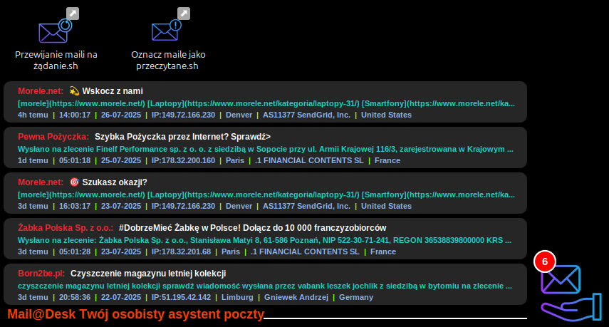
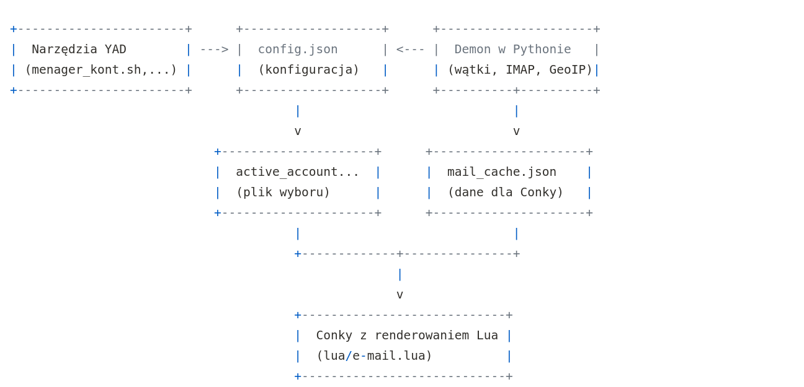
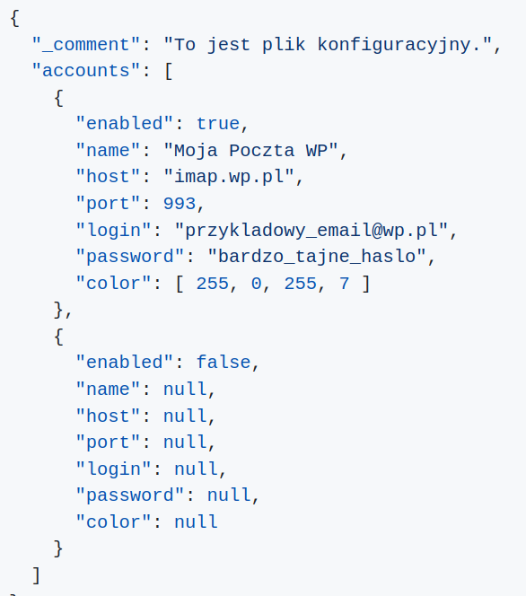

# Conky AutoMail Suite - Zaawansowany Widżet Pocztowy z Obsługą Wielu Kont




**Conky AutoMail Suite** to nie tylko widżet, ale kompletny, modułowy system do monitorowania poczty e-mail w środowisku Conky na Linuksie. Dzięki zaawansowanej architekturze z demonem w Pythonie, graficznym narzędziom konfiguracyjnym i potężnym możliwościom personalizacji w Lua, projekt zapewnia niezrównaną wydajność, stabilność i wygodę użytkowania.

Pakiet oferuje pełne wsparcie dla wielu kont e-mail (do 5), dynamiczne przełączanie widoków, aliasy, a także zestaw graficznych narzędzi do łatwego zarządzania kontami i pocztą bezpośrednio z pulpitu.

## Spis Treści

*   [O Projekcie](#o-projekcie)
*   [Cele Projektu](#cele-projektu)
*   [Główne Filary Projektu](#główne-filary-projektu)
*   [Kluczowe Funkcje](#kluczowe-funkcje)
*   [Architektura Systemu](#architektura-systemu)
*   [Wykorzystane Technologie](#wykorzystane-technologie)
*   [Wymagania](#wymagania)
*   [Instalacja i Konfiguracja](#instalacja-i-konfiguracja)
*   [Użytkowanie i Zarządzanie](#użytkowanie-i-zarządzanie)
*   [Rozwiązywanie problemów](#rozwiązywanie-problemów)
*   [FAQ - Najczęściej Zadawane Pytania](#faq---najczęściej-zadawane-pytania)
*   [Kompatybilność](#kompatybilność)
*   [Autorzy i Kontakt](#autorzy-i-kontakt)
*   [Wkład i Licencja](#wkład-i-licencja)

## O Projekcie

Ten projekt jest owocem współpracy człowieka ze sztuczną inteligencją. Twórcy, nie będąc profesjonalnymi programistami, wykorzystali zaawansowane narzędzia AI do stworzenia tego kompleksowego widżetu. Podkreśla to, że zarówno wkład ludzki w ideę i cel projektu, jak i możliwości generatywne sztucznej inteligencji, były absolutnie kluczowe dla powstania i realizacji Conky AutoMail Suite. Bez zaangażowania twórców projekt by nie zaistniał, a bez wsparcia AI jego realizacja w takiej formie byłaby niemożliwa.

## Cele Projektu

Projekt narodził się z potrzeby stworzenia rozwiązania, które spełnia następujące cele:

*   **Stabilność przede wszystkim:** Koniec z "zamrażaniem się" pulpitu, gdy serwer pocztowy wolno odpowiada lub gdy zrywa się połączenie z internetem. Backend musi być odporny na błędy.
*   **Wydajność:** Widżet nie powinien obciążać systemu. Logika pobierania danych musi być oddzielona od logiki renderowania.
*   **Łatwość użycia:** Zarządzanie kontami i konfiguracja powinny być dostępne dla każdego, bez konieczności edytowania skomplikowanych plików tekstowych.
*   **Głęboka personalizacja:** Użytkownik musi mieć pełną kontrolę nad wyglądem każdego elementu, od czcionek i kolorów po układ i animacje.
*   **Kompletne rozwiązanie "Out-of-the-Box":** Użytkownik powinien otrzymać gotowy pakiet z instalatorem, narzędziami i wszystkim, co potrzebne do natychmiastowego uruchomienia.

## Główne Filary Projektu

System został zbudowany w oparciu o trzy fundamentalne zasady:

1.  **Niezawodny Backend w Pythonie**: Sercem systemu jest wielowątkowy demon, który działa w tle, zapewniając, że powolne serwery czy problemy z siecią nigdy nie zamrożą Twojego pulpitu. Utrzymuje stałe połączenia IMAP, proaktywnie monitoruje dostępność internetu i dynamicznie zarządza konfiguracją bez potrzeby restartu.
2.  **Dynamiczny Frontend w Lua**: Wszystko, co widzisz na ekranie, jest renderowane przez wysoce zoptymalizowany i w pełni konfigurowalny skrypt Lua. Umożliwia on płynne animacje, inteligentne przewijanie tekstu, elastyczne układy oraz personalizację każdego, nawet najmniejszego elementu wizualnego.
3.  **Wygodne Narzędzia Graficzne (YAD)**: Zapomnij o ręcznej edycji plików konfiguracyjnych. Pakiet zawiera zestaw intuicyjnych narzędzi z interfejsem graficznym do dodawania i edycji kont, przełączania widoków czy wykonywania szybkich akcji na wiadomościach bezpośrednio z pulpitu.

## Kluczowe Funkcje

### System Multi-Konto i Zarządzanie
*   **Obsługa do 5 kont IMAP**: Monitoruj wszystkie swoje skrzynki w jednym miejscu.
*   **Aliasy i kolory kont**: Łatwo identyfikuj maile dzięki unikalnym nazwom i kolorom dla każdego konta.
*   **Graficzny menedżer kont (`menager_kont.sh`)**: Interaktywnie dodawaj, edytuj, włączaj i wyłączaj konta w locie.
*   **Dynamiczny selektor widoku**: Przełączaj widok Conky między podsumowaniem wszystkich kont a widokiem jednej lub kilku wybranych skrzynek.
*   **Zarządzanie pocztą z pulpitu (`zarzadzaj-pocztą.sh`)**: Wykonuj zbiorcze akcje (oznacz jako przeczytane, usuń) na wielu kontach jednocześnie.

### Funkcjonalność Widżetu
*   **Szczegółowe informacje o mailach**: Nadawca, temat oraz wieloliniowy, konfigurowalny podgląd treści.
*   **Inteligentne przewijanie tekstu**: Długie nazwy nadawców i tematy są automatycznie przewijane, aby zawsze były czytelne.
*   **Wyróżnianie nowych wiadomości**: Widżet wizualnie zaznacza maile, które pojawiły się od ostatniego odświeżenia, i odtwarza animacje tylko dla nich.
*   **Zaawansowane opcje wizualne**:
    *   Efekt "mlecznej poświaty" i ramki dla każdego maila.
    *   Dynamiczna plakietka (badge) z liczbą nieprzeczytanych wiadomości.
    *   Wskaźnik załącznika (ikona spinacza).
    *   Globalny współczynnik skalowania (`GLOBAL_SCALE_FACTOR`) do łatwego powiększania/zmniejszania całego widżetu.
*   **Integracja z GeoIP**: Wyświetlaj miasto, dostawcę internetu (ISP) i kraj nadawcy.
*   **Konfigurowalna linia meta-danych**: Dodatkowe informacje pod każdym mailem (czas otrzymania, IP, User-Agent itp.).
*   **Powiadomienia dźwiękowe**: Opcjonalne dźwięki dla nowych wiadomości.
*   **Elastyczne układy (`Zmiana_pozycji_okna_conky_v3.sh`)**: Sześć predefiniowanych układów (góra/dół, lewo/prawo, środek) do idealnej integracji z pulpitem.

## Architektura Systemu

Projekt wykorzystuje modułową architekturę, w której każdy komponent ma jasno zdefiniowaną rolę, co zapewnia maksymalną wydajność i stabilność.



## Wykorzystane Technologie

*   **Conky** (z bindingami Lua): Do dynamicznego wyświetlania na pulpicie.
*   **Lua**: Skryptowanie logiki i renderowania widżetu Conky (frontend).
*   **Python 3**: Wielowątkowy demon do komunikacji IMAP i przetwarzania danych (backend).
*   **Bash**: Skrypty instalacyjne i narzędzia zarządzające.
*   **YAD & Zenity**: Używane do tworzenia wszystkich graficznych interfejsów użytkownika (GUI) dla narzędzi konfiguracyjnych i zarządzających.
*   **jq**: Narzędzie do przetwarzania danych JSON z poziomu terminala.

## Wymagania

Instalacja jest w pełni zautomatyzowana. Do prawidłowego działania, projekt wymaga następujących komponentów, które zostaną zainstalowane przez skrypt `1.Instalacja_zależności_v2.sh`:
*   `conky` (z wkompilowanym wsparciem dla Lua 5.3 lub 5.4)
*   `python3`
*   `lua` (w wersji zgodnej z Conky)
*   `yad`
*   `zenity`
*   `jq`
*   `wget`
*   `xrandr` (zwykle w pakiecie `x11-xserver-utils`)
*   `libnotify-bin` (dla `notify-send`)

## Instalacja i Konfiguracja

### Proces Instalacji
Proces instalacji jest w pełni zautomatyzowany dzięki interaktywnym skryptom.

1.  **Uruchom instalator zależności**:
    ```bash
    bash 1.Instalacja_zależności_v2.sh
    ```
    Skrypt automatycznie wykryje Twoją dystrybucję, zainstaluje wymagane pakiety i zweryfikuje wsparcie Lua w Conky.

2.  **Uruchom skrypt konfiguracyjny**:
    Po zakończeniu pierwszego kroku, zostaniesz poproszony o uruchomienie:
    ```bash
    bash 2.Podmiana_wartości_w_zmiennych.sh
    ```
    Ten skrypt automatycznie zaktualizuje ścieżki bezwzględne w plikach projektu.

3.  **Skonfiguruj swoje konta e-mail**:
    Użyj graficznego konfiguratora, aby dodać swoje konta:
    ```bash
    bash menager_kont.sh
    ```

4.  **Uruchom widżet**:
    Na koniec zostaniesz zapytany, czy uruchomić główny skrypt startowy:
    ```bash
    bash 3.START_skryptów_oraz_conky.sh
    ```
    Ten skrypt uruchomi w tle demona Pythona oraz skrypt `watchdog` dla Conky.

### Konfiguracja Ręczna (Dla Zaawansowanych)
Chociaż zalecane jest użycie menedżera graficznego, możesz ręcznie edytować plik `config/config.json`. Upewnij się, że struktura pliku JSON pozostaje poprawna.



---
## Użytkowanie i Zarządzanie

### Codzienne Użytkowanie

Po uruchomieniu przez `3.START_skryptów_oraz_conky.sh`, system działa w pełni autonomicznie w tle. Widżet będzie odświeżał się automatycznie, a demon Pythona będzie dbał o stabilność połączeń.

### Zarządzanie Kontami i Widokiem

*   `menager_kont.sh`: Główne narzędzie do zarządzania. Pozwala edytować dane logowania, aktywować/deaktywować konta oraz wybierać, które konta mają być aktualnie widoczne na pulpicie (wszystkie czy wybrane).

### Zaawansowane Akcje

*   `zarzadzaj-pocztą.sh`: Umożliwia wykonanie operacji na wielu wiadomościach jednocześnie, takich jak oznaczenie wszystkich jako przeczytane czy opróżnienie kosza na wybranym koncie.

### Personalizacja Wyglądu

*   `lua/e-mail.lua`: To centrum personalizacji wizualnej. Plik jest bogato komentowany, aby ułatwić zmianę czcionek, kolorów, odstępów, ikon i układów.
*   `Zmiana_pozycji_okna_conky_v3.sh`: Graficzny konfigurator do szybkiej zmiany pozycji i układu widżetu na ekranie.

---

## Rozwiązywanie problemów

Jeśli widżet nie działa poprawnie, poniższe kroki pomogą zdiagnozować problem.

### Uruchomienie w Trybie Diagnostycznym (Zalecane)

Najskuteczniejszym sposobem na znalezienie błędu jest uruchomienie systemu ręcznie w terminalu. W tym celu:

1.  Otwórz terminal w głównym katalogu projektu.
2.  Uruchom skrypt startowy poleceniem:
    ```bash
    bash 3.START_skryptów_oraz_conky.sh
    ```

Terminal będzie na bieżąco wyświetlał komunikaty i ewentualne błędy pochodzące zarówno z demona Pythona, jak i z samego Conky. To najlepsze miejsce, aby zacząć poszukiwania problemu.

### Sprawdzenie Plików Logów

Jeśli problem występuje sporadycznie lub potrzebujesz bardziej szczegółowych danych, sprawdź następujące pliki w katalogu `log/`:

*   `python_log.txt`: Główne logi i błędy z zaplecza Pythona (jeśli skrypt został uruchomiony z przekierowaniem).
*   `mail_diag.json`: Szczegółowe dane diagnostyczne z każdej sesji pobierania poczty, przydatne do analizy problemów z konkretnymi wiadomościami.

Plik logów Conky może być generowany w głównym katalogu projektu lub w logu systemowym, w zależności od konfiguracji.

---

## FAQ - Najczęściej Zadawane Pytania

Ta sekcja odpowiada na najczęstsze pytania dotyczące konfiguracji, personalizacji i filozofii projektu.

---

**Skonfigurowałem konto, ale widżet nie wyświetla żadnych maili. Co powinienem sprawdzić?**

Najczęstszą przyczyną są dane logowania. Sprawdź kolejno:
1.  **Hasło do Aplikacji:** Upewnij się, że używasz specjalnego "hasła do aplikacji", zwłaszcza dla usług takich jak Gmail, Outlook czy iCloud. Zwykłe hasło do konta nie zadziała.
2.  **Dane Serwera IMAP:** Sprawdź, czy adres serwera (`host`) i port (`port`) w menedżerze kont są poprawne dla Twojego dostawcy poczty.
3.  **Status Konta:** Otwórz `menager_kont.sh` i upewnij się, że konto, które chcesz wyświetlić, ma status "Aktywne".

---

**Dlaczego potrzebuję "hasła do aplikacji" dla konta Gmail i jak je utworzyć?**

Google, w celach bezpieczeństwa, wymaga używania unikalnych haseł dla zewnętrznych aplikacji, które uzyskują dostęp do Twojego konta. Aby je wygenerować:
1.  Wejdź na stronę zarządzania swoim kontem Google.
2.  Upewnij się, że masz włączoną weryfikację dwuetapową.
3.  Przejdź do sekcji "Hasła do aplikacji".
4.  Wygeneruj nowe hasło, nazywając je np. "Conky AutoMail".
5.  Skopiuj wygenerowane 16-znakowe hasło i wklej je w polu hasła w `menager_kont.sh`.

---

**Czy widżet działa na systemach Windows lub macOS?**

Nie. Projekt został zaprojektowany od podstaw z myślą o środowisku Linux i opiera się na technologiach, które są dla niego natywne:
*   **Conky** jest fundamentalnym elementem, który nie jest dostępny na Windows i macOS.
*   Narzędzia graficzne **YAD** i **Zenity** są specyficzne dla ekosystemu Linuksa.
*   Skrypty **Bash** są głęboko zintegrowane z systemem.

Dlatego widżet nie jest i nie będzie kompatybilny z systemami Windows i macOS.

---

**Jak mogę przełączać widok między pojedynczym kontem a podsumowaniem wszystkich kont?**

Służy do tego główne narzędzie projektu. Uruchom `menager_kont.sh` i kliknij przycisk "Wybierz konta". Otworzy się okno, w którym możesz zdecydować, czy chcesz widzieć podsumowanie wszystkich aktywnych kont, czy tylko jedno lub kilka wybranych. Zmiana jest widoczna natychmiast.

---

**Jak mogę dostosować wygląd widżetu?**

Masz do dyspozycji dwa poziomy personalizacji:
*   **Szczegółowy Wygląd:** Wszystkie aspekty wizualne, takie jak czcionki, kolory, odstępy, ikony i animacje, kontrolujesz w pliku `lua/e-mail.lua`. Jest on bogato komentowany, aby ułatwić modyfikacje.
*   **Ogólny Układ:** Do szybkiej zmiany pozycji widżetu na ekranie (np. z dolnego lewego rogu na górny prawy) służy dedykowane narzędzie graficzne `Zmiana_pozycji_okna_conky_v3.sh`.

---

**Dlaczego projekt wykorzystuje aż trzy różne języki programowania (Python, Lua, Bash)?**

Taka architektura to świadomy wybór, podyktowany filozofią "użyj najlepszego narzędzia do danego zadania":
*   **Python** został wybrany dla backendu ze względu na jego potężne biblioteki sieciowe, stabilną obsługę IMAP oraz zaawansowane możliwości wielowątkowości, co gwarantuje wydajność i odporność na błędy.
*   **Lua** to oficjalny i najwydajniejszy język do renderowania grafiki i logiki wewnątrz Conky. Jest niezwykle lekka i szybka, idealna do zadań frontendu.
*   **Bash** w połączeniu z **YAD** i **Zenity** to idealne rozwiązanie do tworzenia prostych, natywnych dla systemu skryptów instalacyjnych i graficznych narzędzi pomocniczych.

---

**Czy przechowywanie haseł w pliku konfiguracyjnym jest bezpieczne?**

Twoje hasła są przechowywane lokalnie na Twoim komputerze w pliku `config/config.json`, wewnątrz katalogu domowego. Projekt nie wysyła ich nigdzie indziej niż bezpośrednio do serwera IMAP Twojego dostawcy poczty. Za bezpieczeństwo pliku odpowiadają standardowe uprawnienia systemu plików Linuksa.


---

## Kompatybilność

Skrypt instalacyjny został zaprojektowany z myślą o szerokiej kompatybilności i był testowany na następujących systemach:

*   **Rodzina Debian/Ubuntu**: Ubuntu 22.04+, Debian 11/12+, Linux Mint 21+
*   **Rodzina Arch Linux**: Arch Linux, Manjaro, Garuda Linux, EndeavourOS, Artix Linux
*   **Rodzina Fedora/Red Hat**: Fedora 38+
*   **Inne**: openSUSE, Solus

Projekt powinien działać na większości nowoczesnych dystrybucji Linuksa, które korzystają z menedżerów pakietów `apt`, `dnf`, `pacman`, `zypper` lub `eopkg`.

---

## Autorzy i Kontakt

### Autorzy projektu
*   **Amator_80**: `<mmajcher804@gmail.com>`
    *   Discord: `Amator80` (Użytkownik na serwerze „Świat Linuksa”)
*   **Zupix**: `<dark.przemi@gmail.com>`
    *   Discord: `Zupix` (Administrator na serwerze „Świat Linuksa”)

### Kontakt społecznościowy
*   Możesz spotkać autorów na Discordzie: **Świat Linuksa**
*   https://discord.com/invite/69EMVfN

### Powiązane projekty
*   **Zupix_Py2Lua_Mail_conky** – bliźniaczy projekt autorstwa Zupixa.
*    https://github.com/ZupixUI/Zupix_Py2Lua_Mail_conky
*    Uwaga: Oba projekty powstały niezależnie i prezentują odmienne podejścia do tematu, dlatego warto zapoznać się z oboma rozwiązaniami.

---

## Wkład i Licencja

Wkład w rozwój projektu jest mile widziany. Jeśli masz pomysły na ulepszenia lub znalazłeś błąd, proszę, utwórz zgłoszenie (issue) lub pull request na GitHubie.

Ten projekt jest udostępniany na licencji **GNU General Public License v3.0**. Oznacza to, że możesz swobodnie używać, modyfikować i rozpowszechniać ten kod, pod warunkiem, że Twoje pochodne prace również będą udostępniane na tej samej licencji.

Pełny tekst licencji znajduje się w pliku `LICENSE` w głównym katalogu projektu.
