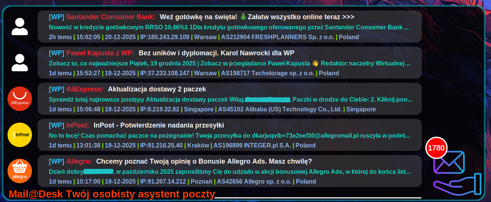

# Conky AutoMail Suite v2.2.0




**Conky AutoMail Suite** to nie tylko widżet, ale kompletny, modułowy system do monitorowania poczty e-mail w środowisku Conky na Linuksie. Dzięki zaawansowanej architekturze z demonem w Pythonie, graficznym narzędziom konfiguracyjnym i potężnym możliwościom personalizacji w Lua, projekt zapewnia niezrównaną wydajność, stabilność i wygodę użytkowania.

Pakiet oferuje pełne wsparcie dla wielu kont e-mail, dynamiczne przełączanie widoków, aliasy, a także zestaw graficznych narzędzi do łatwego zarządzania kontami i pocztą bezpośrednio z pulpitu.

### Co nowego w wersji 2.x.x?
Wersja **2.x.x** wprowadza przełomowe zmiany w architekturze i bezpieczeństwie:
*   **Szyfrowanie Haseł (AES-256):** Koniec z trzymaniem haseł otwartym tekstem. System wykorzystuje OpenSSL i unikalny klucz użytkownika.
*   **System Awatarów:** Widżet wyświetla zdjęcia profilowe nadawców. Możesz zarządzać nimi przez dedykowany `Avatar_Manager.sh`.
*   **Mniej Skryptów, Więcej Automatyzacji:** Zredukowano liczbę skryptów startowych z 4 do 3. Skrypty Lua same wykrywają ścieżki, eliminując ręczną edycję plików.
*   **Zintegrowany Watchdog:** Nowy skrypt startowy sam pilnuje stabilności Conky i zużycia RAM.

### Spis Treści
1.  [O Projekcie](#o-projekcie)
2.  [Główne Filary Projektu](#główne-filary-projektu)
3.  [Kluczowe Funkcje](#kluczowe-funkcje)
4.  [Bezpieczeństwo (Security Pro)](#bezpieczeństwo-security-pro)
5.  [Architektura Systemu](#architektura-systemu)
6.  [Opis Komponentów](#opis-komponentów)
7.  [Wymagania](#wymagania)
8.  [Instalacja i Konfiguracja](#instalacja-i-konfiguracja)
9.  [Użytkowanie i Zarządzanie](#użytkowanie-i-zarządzanie)
10. [Rozwiązywanie problemów](#rozwiązywanie-problemów)
11. [FAQ - Najczęściej Zadawane Pytania](#faq---najczęściej-zadawane-pytania)
12. [Kompatybilność](#kompatybilność)
13. [Autorzy i Licencja](#autorzy-i-licencja)

## O Projekcie
Ten projekt jest owocem współpracy człowieka ze sztuczną inteligencją. Twórcy, nie będąc profesjonalnymi programistami, wykorzystali zaawansowane narzędzia AI do stworzenia tego kompleksowego widżetu. Podkreśla to, że zarówno wkład ludzki w ideę i cel projektu, jak i możliwości generatywne sztucznej inteligencji, były absolutnie kluczowe dla powstania i realizacji Conky AutoMail Suite. Bez zaangażowania twórców projekt by nie zaistniał, a bez wsparcia AI jego realizacja w takiej formie byłaby niemożliwa.

## Główne Filary Projektu
System został zbudowany w oparciu o trzy fundamentalne zasady:

1.  **Niezawodny Backend w Pythonie**: Sercem systemu jest wielowątkowy demon, który działa w tle, zapewniając, że powolne serwery czy problemy z siecią nigdy nie zamrożą Twojego pulpitu. Utrzymuje stałe połączenia IMAP, proaktywnie monitoruje dostępność internetu i dynamicznie zarządza konfiguracją bez potrzeby restartu.
2.  **Dynamiczny Frontend w Lua**: Wszystko, co widzisz na ekranie, jest renderowane przez wysoce zoptymalizowany i w pełni konfigurowalny skrypt Lua. Umożliwia on płynne animacje, inteligentne przewijanie tekstu, elastyczne układy oraz personalizację każdego, nawet najmniejszego elementu wizualnego.
3.  **Wygodne Narzędzia Graficzne (YAD & Zenity)**: Zapomnij o ręcznej edycji plików konfiguracyjnych. Pakiet zawiera zestaw intuicyjnych narzędzi z interfejsem graficznym do dodawania i edycji kont, przełączania widoków czy wykonywania szybkich akcji na wiadomościach bezpośrednio z pulpitu.

## Kluczowe Funkcje

### System Multi-Konto i Zarządzanie
*   **Obsługa Wielu Kont IMAP**: Monitoruj wszystkie swoje skrzynki w jednym miejscu. Backend uruchamia dedykowany, niezależny wątek dla każdego aktywnego konta, zapewniając maksymalną wydajność i izolację błędów.
*   **Rozszerzona Kompatybilność IMAP**: Pełne wsparcie dla obu standardów szyfrowania połączeń: **SSL/TLS** (zazwyczaj port 993) oraz **STARTTLS** (zazwyczaj port 143).
*   **Aliasy i Kolory Kont**: Łatwo identyfikuj maile dzięki unikalnym nazwom (aliasom) i kolorom definiowanym dla każdego konta.
*   **Graficzny Menedżer Kont (`2.menager_kont.sh`)**: Interaktywnie dodawaj, edytuj, usuwaj, zmieniaj kolejność i aktywuj/deaktywuj konta. Zmiany w konfiguracji (np. hasło, host, alias) są wykrywane w locie, a odpowiednie wątki backendu są automatycznie restartowane bez przerywania pracy całego systemu.
*   **Dynamiczny Selektor Widoku**: Przełączaj widok Conky między podsumowaniem wszystkich kont a widokiem jednej lub kilku wybranych skrzynek.
*   **Zaawansowane Zarządzanie Pocztą z Pulpitu (`zarzadzaj-pocztą.sh`)**: Wykonuj zbiorcze akcje (oznacz jako przeczytane/nieprzeczytane, przenieś do kosza, opróżnij kosz) na wszystkich, najnowszych lub najstarszych wiadomościach, z możliwością ustawienia osobnego limitu dla każdego konta w jednej operacji.

### Funkcjonalność Widżetu i Backendu
*   **System Awatarów**: Widżet wyświetla zdjęcia profilowe nadawców. Możesz zarządzać nimi przez dedykowany `Avatar_Manager.sh`.
*   **Szczegółowe Informacje o Mailach**: Wyświetla nadawcę (z kolorowym aliasem konta), temat oraz wieloliniowy, konfigurowalny podgląd treści.
*   **Inteligentne Przewijanie Tekstu**: Długie nazwy nadawców, tematy i inne elementy są automatycznie przewijane (efekt "marquee"), aby zawsze były czytelne, z konfigurowalną prędkością i liczbą powtórzeń.
*   **Dynamiczne Animacje dla Nowych Wiadomości**:
    *   **Pulsowanie Tła/Ramki**: Nowe maile mogą być wyróżnione przez płynną, pulsacyjną animację tła i/lub ramki, z pełną kontrolą nad kolorami, prędkością i czasem trwania.
    *   **Miganie Ikony Załącznika**: Ikona załącznika może migać określoną liczbę razy, aby zwrócić uwagę na nowy plik.
*   **Integracja z GeoIP (Asynchroniczna)**: Backend wyodrębnia publiczny adres IP z nagłówków wiadomości i wykorzystuje kilka publicznych API do wyświetlania miasta, dostawcy internetu (ISP) i kraju nadawcy. Operacja odbywa się w tle, nie blokując startu widżetu.
    *   **Wskazówka:** Aby uzyskać jeszcze dokładniejsze dane geolokalizacyjne, możesz wkleić własny klucz API z [ipgeolocation.io](https://ipgeolocation.io/) do zmiennej `IPGEOLOCATION_API_KEY` w pliku `py/python_mail_conky_lua.py`.
*   **Konfigurowalna Linia Meta-danych**: Dodatkowe informacje pod każdym mailem (czas otrzymania, IP, User-Agent, kraj, status "mobilny" itp.) z możliwością zmiany kolejności i kolorów każdego elementu.
*   **Elastyczne Układy i Skalowanie (`Konfiguracja_pozycji_layoutow_i_skali_conky.sh`)**: Sześć predefiniowanych układów (góra/dół, lewo/prawo, środek) oraz suwak do płynnego skalowania całego widżetu.
*   **Stabilność i Odporność**:
    *   **Zintegrowany Watchdog**: Inteligentny strażnik wbudowany w skrypt startowy (`3.START...`). Automatycznie restartuje Conky, jeśli ten przestanie odpowiadać lub przekroczy zdefiniowany próg zużycia RAM.
    *   **Monitor Internetu**: Dedykowany wątek w backendzie proaktywnie sprawdza dostępność połączenia z internetem.
*   **Operacje w Pamięci RAM dla Maksymalnej Wydajności**: Wszystkie częste operacje zapisu i odczytu (pliki cache, stany, logi) odbywają się w wirtualnym systemie plików `/dev/shm`, czyli bezpośrednio w pamięci RAM.

## Bezpieczeństwo (Security Pro)
W wersji 2.x.x bezpieczeństwo Twoich danych jest priorytetem:
1.  **Szyfrowanie AES-256-CBC:** Hasła w pliku `config/config.json` są zaszyfrowane. Nawet jeśli ktoś wykradnie ten plik, nie odczyta haseł.
2.  **Klucz Prywatny:** Klucz deszyfrujący (`.secret_key`) jest generowany automatycznie i przechowywany w bezpiecznym katalogu domowym użytkownika (`~/.config/conky-mail-secret-key/`), a nie w folderze projektu.
3.  **Master Password:** Menedżer Kont (`2.menager_kont.sh`) może być zabezpieczony hasłem głównym.

## Architektura Systemu
Projekt wykorzystuje modułową architekturę, w której każdy komponent ma jasno zdefiniowaną rolę. Taka separacja logiki zapobiega "zamrażaniu" się pulpitu.

1.  **Skrypty Zarządzające (Bash, YAD, Zenity)**: Zestaw 3 zoptymalizowanych skryptów stanowiących interfejs użytkownika do instalacji i konfiguracji.
2.  **Główny Skrypt Startowy (`3.START_skryptów_oraz_conky.sh`)**: Inicjuje cały system, uruchamiając backend, watchdog i widżet Conky.
3.  **Backend (Python - `python_mail_conky_lua.py`)**: Działa jako demon w tle.
4.  **Plik Cache (JSON w Pamięci RAM)**: Backend agreguje wyniki ze wszystkich kont i zapisuje je w `/dev/shm`.
5.  **Frontend (Lua - `e-mail.lua`)**: Skrypt uruchamiany przez Conky, renderujący widżet.
6.  **Watchdog**: Proces nadzorujący stabilność Conky (zintegrowany ze skryptem startowym).

## Opis Komponentów

| Plik/Katalog | Opis |
| :--- | :--- |
| `py/python_mail_conky_lua.py` | **Główny backend.** Wielowątkowy demon Pythona, który pobiera i przetwarza e-maile. |
| `lua/e-mail.lua` | **Główny frontend.** Skrypt Lua renderujący widżet w Conky. |
| `config/config.json` | **Baza danych kont.** Plik JSON z konfiguracją (hasła są zaszyfrowane). |
| `conkyrc_mail` | Główny plik konfiguracyjny Conky. |
| `1.Instalacja_zależności_v2.sh` | **Instalator.** Instaluje zależności i przygotowuje środowisko (zastąpił dawne skrypty 1 i 2). |
| `2.menager_kont.sh` | **Menedżer kont.** Główne centrum dowodzenia. Zarządza kontami i szyfruje hasła. |
| `3.START_skryptów_oraz_conky.sh` | **Skrypt startowy.** Uruchamia demona Pythona, Conky i wbudowanego Watchdoga. |
| `Avatar_Manager.sh` | **Menedżer awatarów.** Narzędzie do przypisywania obrazków do adresów e-mail. |
| `Konfiguracja_pozycji...sh` | **Konfigurator wyglądu.** Graficzne narzędzie do zmiany pozycji i układu. |
| `zarzadzaj-pocztą.sh` | **Menedżer poczty.** Graficzne narzędzie do wykonywania zbiorczych akcji na wiadomościach. |

## Wymagania
Instalacja jest w pełni zautomatyzowana. Do prawidłowego działania, projekt wymaga komponentów instalowanych przez skrypt `1.Instalacja_zależności_v2.sh`:
*   `conky` (z wkompilowanym wsparciem dla Lua 5.3 lub 5.4)
*   `python3` + `openssl` (do szyfrowania)
*   `lua` (w wersji zgodnej z Conky)
*   `yad`, `zenity`, `jq`, `wget`, `xrandr`, `libnotify-bin`

## Instalacja i Konfiguracja
Proces instalacji został uproszczony do 3 kroków.

1.  **Uruchom instalator zależności:**
    ```bash
    bash 1.Instalacja_zależności_v2.sh
    ```
    Skrypt automatycznie wykryje Twoją dystrybucję i zainstaluje wymagane pakiety.

2.  **Skonfiguruj swoje konta e-mail:**
    Użyj graficznego konfiguratora, aby dodać swoje konta i utworzyć Hasło Główne:
    ```bash
    bash 2.menager_kont.sh
    ```

3.  **Uruchom widżet:**
    Na koniec uruchom główny skrypt startowy:
    ```bash
    bash 3.START_skryptów_oraz_conky.sh
    ```

## Użytkowanie i Zarządzanie
Po uruchomieniu przez `3.START_skryptów_oraz_conky.sh`, system działa w pełni autonomicznie w tle.

*   **Zarządzanie Kontami i Widokiem (`2.menager_kont.sh`)**: Główne narzędzie do zarządzania. Pozwala edytować dane logowania (zabezpieczone Hasłem Głównym) oraz wybierać aktywne konta.
*   **Menedżer Awatarów (`Avatar_Manager.sh`)**: Uruchom to narzędzie, aby dodać zdjęcia znajomych lub loga sklepów, które będą wyświetlane przy wiadomościach.
*   **Personalizacja Wyglądu (`Konfiguracja_pozycji_layoutow_i_skali_conky.sh`)**: Graficzny konfigurator do szybkiej zmiany pozycji i układu. **Uwaga:** Widżet jest zoptymalizowany dla 4K. Narzędzie do skalowania pozwala na idealne dopasowanie rozmiaru na monitorze 4K. Przy użyciu na niższych rozdzielczościach (np. Full HD), znaczne zmniejszenie skali może prowadzić do utraty ostrości czcionek i grafiki.
*   **Zaawansowane Akcje (`zarzadzaj-pocztą.sh`)**: Interaktywne narzędzie do wykonywania zaawansowanych operacji na wiadomościach.
*   **Szczegółowa Personalizacja (`lua/e-mail.lua`)**: To centrum personalizacji wizualnej.

## Rozwiązywanie problemów
Jeśli widżet nie działa poprawnie, poniższe kroki pomogą zdiagnozować problem.

### Uruchomienie w Trybie Diagnostycznym (Zalecane)
Najskuteczniejszym sposobem na znalezienie błędu jest uruchomienie systemu ręcznie w terminalu. W tym celu:

1.  Otwórz terminal w głównym katalogu projektu.
2.  Zatrzymaj wszystkie działające instancje, jeśli istnieją, uruchamiając `3.START_skryptów_oraz_conky.sh` i wybierając opcję zatrzymania.
3.  Uruchom skrypt startowy ponownie w trybie debugowania:
    ```bash
    bash 3.START_skryptów_oraz_conky.sh --debug
    ```

Uruchomienie skryptu w ten sposób sprawi, że wszystkie komunikaty, logi i ewentualne błędy z Pythona oraz Conky będą wyświetlane na bieżąco w tym oknie terminala.

### Sprawdzenie Plików Logów
Jeśli problem występuje sporadycznie lub potrzebujesz bardziej szczegółowych danych, sprawdź plik `log/mail_diag.json`. Zawiera on szczegółowe dane diagnostyczne z każdej sesji pobierania poczty.

## FAQ - Najczęściej Zadawane Pytania

**P: Dla jakiej rozdzielczości ekranu widżet jest zoptymalizowany?**
O: Domyślne ustawienia są zoptymalizowane pod **4K (3840x2160)**. Użyj narzędzia do skalowania, aby dopasować go do mniejszych ekranów (np. Full HD).

**P: Dlaczego moje główne hasło do konta nie działa? (Hasła do aplikacji)**
O: Wielu dostawców (Google, Microsoft) wymaga **"hasła do aplikacji"** zamiast głównego hasła. Wygeneruj je w ustawieniach bezpieczeństwa konta e-mail.

**P: Jak przełączać widok między kontami?**
O: Uruchom `2.menager_kont.sh` i kliknij przycisk "Wybierz konta".

**P: Czy przechowywanie haseł w pliku konfiguracyjnym jest bezpieczne?**
O: **Tak, w wersji 2.x.x jest to bardzo bezpieczne.** Hasła w pliku `config/config.json` są zaszyfrowane algorytmem AES-256. Bez Twojego unikalnego klucza (przechowywanego poza folderem projektu) plik ten jest bezużyteczny dla osób postronnych.

## Kompatybilność
Skrypt instalacyjny został zaprojektowany z myślą o szerokiej kompatybilności i był testowany na następujących systemach:
*   **Rodzina Debian/Ubuntu**: Ubuntu 22.04+, Debian 11/12+, Linux Mint 21+
*   **Rodzina Arch Linux**: Arch Linux, Manjaro, Garuda Linux, EndeavourOS, Artix Linux
*   **Rodzina Fedora/Red Hat**: Fedora 38+
*   **Inne**: openSUSE, Solus

## Autorzy i Licencja
**Autorzy projektu**
*   **Amator_80**: `<mmajcher804@gmail.com>` (Discord: `Amator80`)
*   **Zupix**: `<dark.przemi@gmail.com>` (Discord: `Zupix`)

Możesz spotkać autorów na serwerze Discord: **Świat Linuksa** - [https://discord.com/invite/69EMVfN](https://discord.com/invite/69EMVfN)

### Powiązane Projekty

Warto również zapoznać się z siostrzanym projektem autorstwa Zupixa, który stanowi alternatywne podejście do tego samego zagadnienia:

*   **Zupix Py2Lua Mail Conky** – Drugi w pełni funkcjonalny widżet do monitorowania poczty, rozwijany równolegle.
    *   **Repozytorium na GitHub:** [https://github.com/ZupixUI/Zupix-Py2Lua-Mail-conky](https://github.com/ZupixUI/Zupix-Py2Lua-Mail-conky)

> **Warto wiedzieć:** Oba projekty, choć zrodzone z podobnej idei, powstały i były rozwijane niezależnie. Prezentują odmienne filozofie i rozwiązania techniczne. Zachęcamy do zapoznania się z oboma, aby wybrać widżet, który najlepiej pasuje do Twoich oczekiwań i stylu pracy.

**Wkład i Licencja**
Wkład w rozwój projektu jest mile widziany. Jeśli masz pomysły na ulepszenia lub znalazłeś błąd, proszę, utwórz zgłoszenie (issue) lub pull request na GitHubie.

Ten projekt jest udostępniany na licencji **GNU General Public License v3.0**. Oznacza to, że możesz swobodnie używać, modyfikować i rozpowszechniać ten kod, pod warunkiem, że Twoje pochodne prace również będą udostępniane na tej samej licencji.
